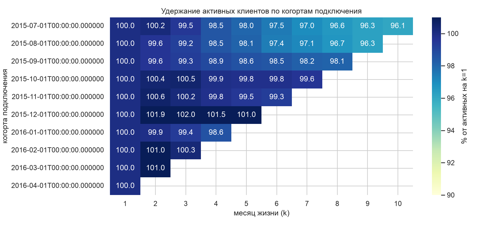

# Отток клиентов банка по когортам

Задача: банк хочет понять, кто уходит из продуктов, когда именно и что удерживает клиента.
Данные - соревнование Kaggle [Santander Product Recommendation](https://www.kaggle.com/c/santander-product-recommendation):
17 месячных снимков по клиентам испанского банка за январь 2015 - май 2016, 13,6 млн строк,
956 645 клиентов, 24 признака клиента и 24 флага продуктов.

## Главное

- **На уровне клиента оттока почти нет.** Когорты июля 2015 - апреля 2016 удерживают 96-100%
  активных клиентов от второго месяца жизни к десятому. Причина не в лояльности: почти у всех
  есть текущий счёт, а его никто не закрывает. Считать отток по принципу «клиент ушёл из банка»
  на этих данных бессмысленно
- **Отток живёт на уровне продуктов.** Лидеры по переходам 1 → 0 за 17 месяцев: автоплатёж
  136 594, текущий счёт 89 644, зачисление пенсии 76 112
- **Единого определения оттока для всех продуктов не существует.** У зачисления пенсии 55,8%
  «уходов» - это мигание флага (1 → 0 → 1), у зарплаты 50,0%, у автоплатежа 37,7%, а у депозитов,
  ипотеки и пенсионного плана - меньше 1%. Если не отделить мигания, отток по зарплатно-пенсионным
  продуктам завышается примерно вдвое
- **Опасное окно - третий и четвёртый месяц жизни, а не первый.** Отток продукта растёт с 2,11%
  в месяц на k=1 до 3,22% на k=4 и потом спадает до 1,47% к k=10. Полное обнуление набора,
  наоборот, максимально сразу (1,73%) и дальше падает в три раза
- **Cross-sell защищает, но только если считать внутри сегмента.** Наивный агрегат даёт обратный
  ответ: 1 продукт - 5,0% обнулившихся за полгода, 2 продукта - 9,7%, 3 и больше - 2,1%. Внутри
  сегментов картина другая, и это парадокс Симпсона в чистом виде



## Задачи проекта

- Определить, какие когорты на этой панели вообще можно считать, и отделить свойства клиентской
  базы от артефактов выгрузки
- Сформулировать честное определение оттока для продукта и для клиента, с поправкой на мигание
  флага и на дырки в панели
- Построить когортные матрицы удержания и найти месяц жизни, в котором риск максимален
- Проверить гипотезы про cross-sell, канал привлечения и сегмент

## Оговорки по данным

- **Панель не однородна по месяцам.** В июле 2015 выгрузку расширили: клиентов стало 829 817
  против 632 110 в июне. Добавленные клиенты не новые - у них давняя `fecha_alta` (26,7 тыс.
  подключились в 2014-м, 19,1 тыс. в 2013-м, дальше вглубь до 2001 года), и в 91,1% их строк нет
  ни одного продукта. Поэтому «25% клиентов банка без продуктов» по всей панели - артефакт, а не
  факт о базе: у клиентов, которые были до июля, таких строк 3,7%
- **Когорты до июля 2015 непригодны.** Они видны в свой месяц подключения только на 54-59%, а
  когорты с июля - на 99,2-99,9%. Рабочее окно - **июль 2015 - апрель 2016**, в него попадают
  127 034 клиента. Апрель, а не май, потому что май 2016 - последний снимок и отток по нему не
  определён
- **В когорту берём только тех, чей первый месяц в панели совпал с месяцем подключения.** Без
  этого условия клиенты с ранней `fecha_alta` наполняют свои когорты задним числом, и матрица
  выдаёт удержание выше 100%
- **Первый месяц жизни (k=0) занижен.** У 51 379 членов когорт в месяц подключения нет ни одного
  продукта, при этом у 14 900 из них продукт появляется на следующий месяц - договор оформлен, а
  в снимок попал позже. Поэтому удержание считаем от k=1
- **Один блок битых строк**: 27 734 строки (7340 клиентов), где одновременно пустая `fecha_alta`
  и нечисловые `age` и `antiguedad`. Живёт только в первой половине 2015 года и затухает
  (январь 6953 строки, июнь 1861, с июля ни одной) - дефект выгрузки, который потом починили
- **`renta` (доход домохозяйства) пропущена в 20,5% строк** - только вспомогательный разрез.
  `antiguedad` содержит служебное -999999, максимальный `age` - 164 года
- **0,84% клиентов (8018) имеют дырки в истории** - пропущенный месяц не считаем оттоком, пока не
  проверили следующие месяцы
- **Не отток:** 2731 умерший клиент (`indfall = S`), 4484 «бывших» по `indrel_1mes`, 19 889 с
  заполненной датой ухода `ult_fec_cli_1t`
- **Канал и сегмент связаны:** почти все студенты пришли через один канал, поэтому разделить
  «плохой канал» и «такая аудитория» на этих данных нельзя

## Гипотезы

| # | Гипотеза | Результат |
|---|---|---|
| 1 | Клиенты с несколькими продуктами уходят реже | Подтвердилась, но только внутри сегмента. Три продукта и больше снижают риск обнуления везде: VIP 9,5% против 34,8% у одиночного продукта, физлица 1,8% против 8,5%, студенты 1,4% против 3,8%. Агрегат по всей выборке переворачивается, т к группа «1 продукт» на 77% состоит из студентов с низким оттоком |
| 2 | Важно не число продуктов, а какие именно | Подтвердилась: у клиентов с двумя продуктами пара «текущий счёт + автоплатёж» даёт 3,3% обнулений за полгода, любая другая пара - 16,6%, разница в пять раз |
| 3 | Отток сконцентрирован в первых месяцах жизни | Подтвердилась с поправкой: пик не на первом месяце, а на третьем-четвёртом (3,22%), дальше спад |
| 4 | Канал привлечения определяет удержание | Частично: KHO даёт 90,1% активных через полгода, KHN 87,0%, а самый массовый KHQ (63 030 клиентов) - 76,1%. Но KHQ приводит в основном студентов, и вклад канала от вклада аудитории здесь не отделить |
| 5 | Чем дольше клиент с банком, тем реже уходит | Не подтвердилась в лоб: при стаже 10+ лет клиент теряет отдельный продукт чаще (4,73% в месяц против 2,64% при стаже 3-6 лет), но обнуляет набор реже (0,22% против 0,27%). У старых клиентов просто больше продуктов |

## Стек

Python (pandas, matplotlib, seaborn), SQL в DuckDB поверх parquet - панель на 13,6 млн строк не
грузим в pandas, считаем оконными функциями (`lag`, `lead`, `arg_min`) и забираем только
агрегаты. Jupyter, Git.

## Выводы

Что это значит для работы с оттоком:

- Метрику «отток клиента» на такой панели показывать нельзя - она всегда будет около нуля из-за
  текущего счёта. Управленческий смысл есть только в оттоке по продуктам
- Для зарплатно-пенсионных продуктов отток надо считать с окном: нет флага 2-3 месяца подряд.
  Для депозитов, ипотеки и кредитов достаточно одного месяца
- Работать с клиентом надо на третий-четвёртый месяц жизни, а не в момент подключения
- Второй продукт стоит продавать не любой, а привязывающий: по автоплатежу идут регулярные
  списания, и клиент с парой «счёт + автоплатёж» обнуляется в пять раз реже
- Сравнивать группы клиентов по числу продуктов без контроля сегмента нельзя - получите вывод,
  обратный правильному

## Структура репозитория

```
santander-churn-cohorts/
├── notebooks/
│   ├── 01_data_quality.ipynb   - панель по месяцам, артефакт июля, мусор, дырки, выбор окна когорт
│   └── 02_cohorts_churn.ipynb  - матрицы удержания, отток по продуктам, мигания, гипотезы
├── src/
│   └── functions.py            - загрузка панели в DuckDB, членство когорт, матрица удержания,
│                                 переходы по продуктам
├── data/raw/                   - train_ver2.csv и словарь полей (данные в репозиторий не входят)
├── data/processed/              - train.parquet
├── reports/figures/            - графики для README
└── requirements.txt
```

## Как запустить

```bash
python -m venv .venv && source .venv/bin/activate
pip install -r requirements.txt
```

Дальше нужен доступ к данным: на [странице соревнования](https://www.kaggle.com/c/santander-product-recommendation/rules)
принять правила, затем положить `train_ver2.csv` в `data/raw/`:

```bash
kaggle competitions download -c santander-product-recommendation -f train_ver2.csv.zip -p data/raw
unzip data/raw/train_ver2.csv.zip -d data/raw
```

Ноутбук `01_data_quality.ipynb` при первом запуске сам переложит csv в parquet (около 40 секунд),
дальше открывать по порядку. Описание всех 48 полей - в `data/raw/santander_data_dictionary.md`.
