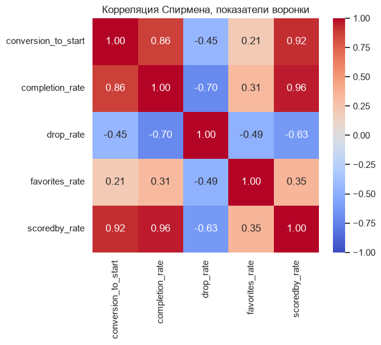

# Продуктовая аналитика аниме-каталога

Задача: стриминговый сервис хочет выпустить своё аниме. Нужно решить, во что вкладывать контент-бюджет, чтобы максимизировать охват, удовлетворённость и удержание аудитории. Для этого проанализируем данные MyAnimeList - социальной сети, посвящённой аниме: карточки и статистика по 29К тайтлов и 124М пользовательских взаимодействий от 309К пользователей.

## Главное
- **60% потерь зрителей - в первых трёх сериях.** У 12-серийных сериалов до финала не доходят 26% начавших, и больше половины из них уходит до 3-й серии. Самый большой обрыв - между 1 и 2 серией (5.2 п.п.)
- **`ep3_retention` - ранний сигнал досматриваемости.** Со Спирменом 0.90 повторяет `completion_rate`, но известен на 9 недель раньше, т е им можно пользоваться в решении о продлении
- **Верх рейтинга - сиквелы, и это структурный эффект.** 60% топ-20 - продолжения, а 92.8% аудитории сиквела уже досмотрели прошлую часть. Сравнивать сиквелы и дебюты по `completion_rate` некорректно
- **Удерживает не первоисточник, а масштаб тайтла.** Ранобэ держит к 3-й серии 88.6% начавших против 80.4% у `Original`, но внутри квартилей по размеру аудитории разница сжимается до пары п.п.
- **Флагманы - экранизации популярной манги** (50% манги, Romance и Comedy чаще, чем по выборке): медианно ~380К начавших, конверсия в старт 0.79 и `completion_rate` 0.62 против 0.35 у «остальных». Оригинальные проекты почти не попадают во флагманы - 5% при 15% по выборке



## Задачи проекта
- Исследовать данные и понять, по каким признакам можно классифицировать аниме; По каким признакам лучше измерять охват, удовлетворённость и удержание.
- Выдвинуть несколько гипотез, которые можно проверить на этом датасете и отсортировать их по значимости
- Посчитать воронку и удержание по сериям, найти профиль тайтлов с лучшей комбинацией метрик и сформулировать, во что вкладывать бюджет

## Контекст
Аниме можно классифицировать по следующим входным характеристикам:
1) Тип - фильм, сериал, OVA (details.type)
2) Жанр - комедия, детектив, хоррор и т. д. (details.genre)
3) Тематика - исекай, школа, меха и т. д. (details.themes)
4) Целевая аудитория - kids, seinen, shounen и т. д. (details.demographics)
5) Первоисточник - original, manga, visual novel и т. д. (details.source)
6) Возрастной рейтинг - PG-Children, PG-13 и т. д. (details.rating)
7) Количество эпизодов (details.episodes)
8) Год выхода. Конечно, нам будут более интересны новые тайтлы (details.year)

Охват можно оценить по следующим признакам:
1) Число пользователей, оценивших аниме (details.scored_by)
2) Оценка популярности от MyAnimeList (details.popularity)
3) Общее число пользователей, добавивших аниме в свои списки (details.members или stats.total)
4) Число пользователей, смотрящих данное аниме сейчас (stats.watching)
5) Число пользователей, планирующих просмотр (stats.plan_to_watch)


Удовлетворённость можно оценить по следующим признакам:
1) Позиция в общем рейтинге всех тайтлов по оценке (details.rank)
2) Количество пользователей, отметивших аниме как любимое (details.favorites)
3) Средняя оценка по 10-бальной шкале (details.score)
4) Распределение оценок (stats.score_x_votes, stats.score_x_percentage)

Удержание можно оценить по следующим признакам:
1) Число пользователей, досмотревших аниме (stats.completed)
2) Число приостановивших просмотр (stats.on_hold)
3) Число бросивших просмотр (stats.dropped)
Также эта информация есть в ratings.status
4) Пересматривается ли это аниме (ratings.is_rewatching)
5) Число просмотренных эпизодов (ratings.num_watched_episodes)

### Оговорки по данным
- `ratings` - это не вся аудитория MAL, а выгрузка по 309К пользователей, которые ведут списки. Такие досматривают чаще среднего зрителя: доля досмотревших по `ratings` 0.740 против 0.678 по `stats`. Абсолютные уровни удержания завышены, но смещение общее, поэтому тайтлы между собой сравнивать можно
- `dropped` занижен - брошенные аниме часто так и остаются лежать в `watching`
- Метрики воронки считаем только по `Finished Airing`, у выходящих тайтлов воронка ещё не закрыта. Разрезы - только TV с 2020 года и `started >= 1000` (1101 тайтл), у мелких тайтлов доли слишком шумные
- Пустой `score` (34.8%) означает «оценки нет», а не 0. У 9643 тайтлов голоса в `stats` есть, а агрегированной оценки нет
- Франшизы склеены по префиксу названия, поэтому попадаются ремейки и ложные пары. Отсекаем их по `from_prequel < 0.5` - это 40 пар из 327
- `favorites_rate` по выборке крошечный (медиана 0.0044): как ось сегментации работает, но точных выводов на нём одном не построить

## Гипотезы
| # | Гипотеза | Результат |
|---|---|---|
| 1 | Судьба тайтла решается в первых сериях | Подтвердилась: 60% потерь - в первых 3 сериях, кривые сегментов дальше идут параллельно |
| 2 | Сиквелы выглядят лучше дебютов из-за отбора аудитории | Подтвердилась: медианная `from_prequel` 0.928, `completion_rate` 0.479 против 0.412 при почти равной конверсии в старт |
| 3 | Экранизации манги и ранобэ удерживают лучше оригиналов | Не подтвердилась: эффект объясняется размером аудитории, внутри квартилей почти исчезает |
| 4 | Возврат в следующий сезон зависит от первоисточника | Пока наблюдение: манга 0.564 против 0.466 у `Original`, но на 30 парах это может быть шум |

## Стек
Python (pandas, NumPy, SciPy, matplotlib, seaborn), SQL в DuckDB поверх parquet - 124М строк `ratings` не грузим в pandas, Jupyter, Git

## Выводы
Что это значит для контент-бюджета при планировании своего аниме:
- Наибольший охват при высоком удержании дают экранизации уже популярной манги с элементами Comedy или Romance - профиль сегмента «флагманы» (165 тайтлов)
- Адаптации ранобэ-исекай (55% ранобэ и 73% Fantasy в сегменте «надёжный просмотр») досматривают почти как флагманы, но начавших у них в 2.5 раза меньше (~145К против ~380К), а в избранное добавляют в 2.5 раза реже (`favorites_rate` 0.004 против 0.010) - меньше органического продвижения и спроса на продолжения
- Оригинальный проект рискованнее по охвату, зато чаще попадает в «нишевые любимчики» (19% против 5% во флагманах): аудитория меньше, но привязанность выше средней; ниша - драма и приземлённые сюжеты
- При отборе тайтлов сиквелы и дебюты надо разделять, иначе рейтинг превращается в список франшиз. Здоровье франшизы смотрим по `carryover_start`: медиана 0.538, т е около половины досмотревших сезон продолжение даже не начинают
- Решение о продлении можно принимать по `ep3_retention`, не дожидаясь финала сезона

## Структура репозитория
```
anime-product-analytics/
├── notebooks/
│   ├── 01_data_quality.ipynb   - пропуски, дубликаты, аномалии, сверка таблиц
│   └── 02_EDA&metrics.ipynb    - воронка, корреляции, сегменты, удержание по сериям, сиквелы, первоисточник
├── src/
│   ├── functions.py            - fancy_info, detect_anomaly, check_consistency
│   └── export_tableau.py       - выгрузка метрик в csv для дашборда
├── sql/mal_schema.sql          - схема таблиц MyAnimeList
├── reports/figures/            - ERD и графики
├── data/raw/                   - исходные данные (в репозиторий не входят)
└── requirements.txt
```

## Как запустить
```bash
python -m venv .venv && source .venv/bin/activate
pip install -r requirements.txt
```
Положить выгрузку MyAnimeList (`details.csv`, `stats.csv`, `ratings.parquet` и остальные таблицы из [data dictionary](reports/figures/mal_schema_erd.md)) в `data/raw/` и открыть ноутбуки по порядку.
