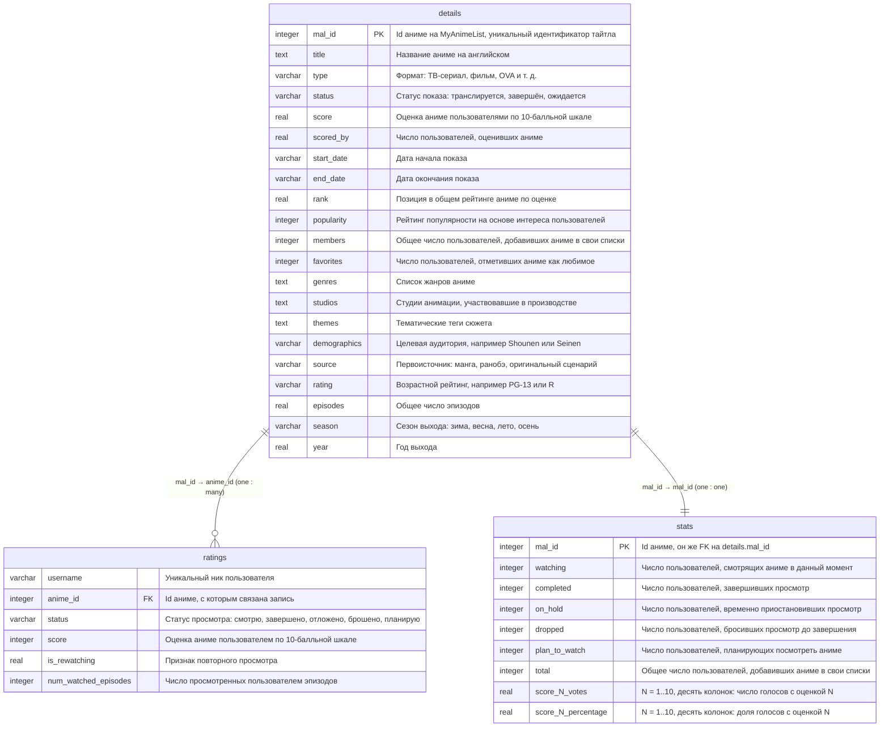

# MyAnimeList — схема данных

Диаграмма построена по трём таблицам датасета Kaggle «Anime Dataset (Jan 1917 – Oct 2025)».
`details` хранит характеристики самих тайтлов — жанры, оценки, популярность, даты выхода.
`ratings` — взаимодействия отдельных пользователей с разными тайтлами.
`stats` — агрегированные по каждому тайтлу показатели.

Часть полей на диаграмме скрыта — они не используются в проекте.
Интерактивная версия: [`mal_schema_erd.html`](mal_schema_erd.html).

| Таблица | Колонок | Ключи |
|---|---|---|
| `details` | 29 | 1 PK |
| `ratings` | 6 | 1 FK, 1 UNIQUE |
| `stats` | 27 | 1 PK + FK |

## ERD

**Связи**

- `ratings` → `details` — многие к одному по `anime_id = mal_id`. Один пользователь может взаимодействовать со многими тайтлами, один тайтл — с многими пользователями; в таблице уникальна пара `(username, anime_id)`.
- `stats` → `details` — один к одному по `mal_id`. Проверено в [`01_data_quality.ipynb`](../../notebooks/01_data_quality.ipynb): обе таблицы по 28955 строк, наборы ключей совпадают в обе стороны.

Блок оценок в `stats` записан как 20 отдельных колонок — `score_1_votes` … `score_10_votes` и `score_1_percentage` … `score_10_percentage`. На диаграмме они свёрнуты в две строки с `N` вместо номера, чтобы не растягивать схему.

## Data dictionary

### `ratings`

| Поле | Тип | Описание |
|---|---|---|
| `username` | varchar(50) | Уникальный ник пользователя |
| `anime_id` | integer | Id аниме, с которым связана запись |
| `status` | varchar(50) | Статус просмотра: смотрю, завершено, отложено, брошено, планирую посмотреть |
| `score` | integer | Оценка аниме пользователем по 10-балльной шкале |
| `is_rewatching` | real | Признак того, что пользователь пересматривает аниме повторно |
| `num_watched_episodes` | integer | Число просмотренных пользователем эпизодов |

### `details`

| Поле | Тип | Описание |
|---|---|---|
| `mal_id` | integer | Id аниме на MyAnimeList, уникальный идентификатор тайтла |
| `title` | text | Название аниме на английском |
| `type` | varchar(50) | Формат: ТВ-сериал, фильм, OVA и т. д. |
| `status` | varchar(50) | Статус показа: транслируется, завершён, ожидается |
| `score` | real | Оценка аниме пользователями по 10-балльной шкале |
| `scored_by` | real | Число пользователей, оценивших аниме |
| `start_date` | varchar(50) | Дата начала показа |
| `end_date` | varchar(50) | Дата окончания показа |
| `rank` | real | Позиция в общем рейтинге аниме по оценке |
| `popularity` | integer | Рейтинг популярности на основе интереса пользователей |
| `members` | integer | Общее число пользователей, добавивших аниме в свои списки |
| `favorites` | integer | Число пользователей, отметивших аниме как любимое |
| `genres` | text | Список жанров аниме. Например `['Adventure', 'Drama', 'Fantasy']` |
| `studios` | text | Студии анимации, участвовавшие в производстве |
| `themes` | text | Тематические теги сюжета, например `['School', 'Team Sports']` |
| `demographics` | varchar(50) | Целевая аудитория, например Shounen или Seinen |
| `source` | varchar(50) | Первоисточник: манга, ранобэ, оригинальный сценарий и т. д. |
| `rating` | varchar(50) | Возрастной рейтинг, например PG-13 или R |
| `episodes` | real | Общее число эпизодов |
| `season` | varchar(50) | Сезон выхода: зима, весна, лето, осень |
| `year` | real | Год выхода |

### `stats`

| Поле | Тип | Описание |
|---|---|---|
| `mal_id` | integer | Id аниме на MyAnimeList |
| `watching` | integer | Число пользователей, смотрящих аниме в данный момент |
| `completed` | integer | Число пользователей, завершивших просмотр |
| `on_hold` | integer | Число пользователей, временно приостановивших просмотр |
| `dropped` | integer | Число пользователей, бросивших просмотр до завершения |
| `plan_to_watch` | integer | Число пользователей, планирующих посмотреть аниме |
| `total` | integer | Общее число пользователей, добавивших аниме в свои списки |
| `score_1_votes` | real | Число пользователей, поставивших оценку 1/10 |
| `score_1_percentage` | real | Доля голосов с оценкой 1/10 от всех оценивших |
| `score_2_votes` | real | Число пользователей, поставивших оценку 2/10 |
| `score_2_percentage` | real | Доля голосов с оценкой 2/10 от всех оценивших |
| … | … | и так далее до 10 |
